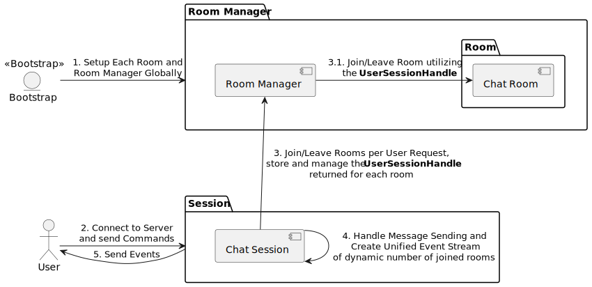

# Rust Chat Server - Server Binary

The `server` binary is the backbone of the [rust-chat-server](../). It establishes a TCP server, listening for events and commands through our [comms library](../comms).

---

## 🛠 Technical Overview

- **Async I/O**: Utilizes [Tokio Runtime](https://tokio.rs/) and [Tokio Streams](https://tokio.rs/tokio/tutorial/streams) for asynchronous, non-blocking I/O.
- **Actor-like Model**: Uses [Tokio Channels](https://tokio.rs/tokio/tutorial/channels) for an actor-inspired, lightweight architecture.
- **Chat Rooms**: File-based (JSON) chat room definitions in the [resources/](./resources/chat_rooms_metadatas.json) folder.

## 🏗 High-Level Architecture 

1. **Bootstrap**: Reads from [resources/](./resources/chat_rooms_metadatas.json) to initialize chat rooms.
2. **Server Start**: Handles a variable number of concurrent users. For a terminal-based client, see the [tui project](../tui/).
    - **Commands**: Join, leave rooms or send room-specific messages.
3. **ChatSession**: Manages individual user commands and room subscriptions.
    - Joins rooms via interaction with `RoomManager`, receiving a `broadcast::Receiver<Event>` and a `UserSessionHandle`.
    - On room exit, `UserSessionHandle` is returned to `RoomManager`.
4. **Messaging**: Maintains an in-memory list of `UserSessionHandle`s for room messaging.
    - Tasks are created to unify messages from different rooms into a single `mpsc::Receiver<Event>`.
5. **User Output**: Unified events are sent to the user through the TCP socket.

## 🚀 Getting Started

Run the server with `cargo run` or `cargo run --bin server` according to your working directory. Defaults to port `:8080`. Any bootstrap issues will result in an application exiting with error.

## 🧪 Stress Testing

- **Example**: Check [stress_test](./examples/stress_test.rs) in the examples directory.
- 🚨 **Socket Limits**: Ensure both server and stress test socket limits are configured for high user volumes.
  
Run the stress test with `cargo run --example stress_test`.

### 📈 Stress Test Outcomes

> 🚫 No rigorous load testing was conducted, but several preliminary tests were done.

Using a $4/month [DigitalOcean](https://www.digitalocean.com/pricing/droplets) Droplet, a test was run with 48 users (2 per room), each sending 200 messages per second. This resulted in **576k RPM Write** and **1.152M RPM Read**.

CPU reached 100% utilization without any significant lag or memory impact. When the load was reduced by 50%, CPU utilization decreased to 56-60%. With higher loads, there were delivery lags.

On an Apple Silicone M2 Pro, the system could easily handle 10k concurrent users with a lower message rate.

## 📈 Scaling Further

The server is currently optimized for vertical scaling by making full use of multiple cores. However, it can only scale so far within a single instance, bound by the hardware or code optimization limits.

To truly scale horizontally, several strategies can be employed:

1. **Sharding Rooms**: Distribute chat rooms among multiple server instances, directing users to the correct instance based on their room selection.
2. **Fan-Out Queue**: Incorporate a fan-out message queue architecture where each server instance consumes and broadcasts messages to its connected users.

Your choice will depend on specific requirements:

- **Limited Users, Multiple Rooms**: Option #1 is ideal for a Discord-like architecture with multiple rooms but limited users per server (e.g., up to 1,000).
- **Global Rooms, High Concurrency**: For a setup where room lists are global and user counts are high, option #2 offers better scalability.
- **High Volume, Hybrid Approach**: If you expect both high user counts and multiple servers, a hybrid approach of options #1 and #2 would provide the greatest scalability.
